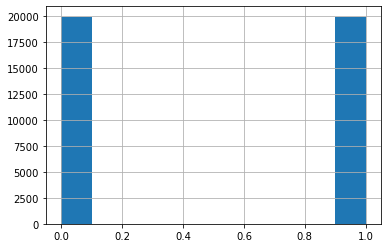
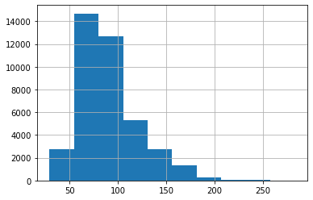
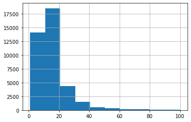
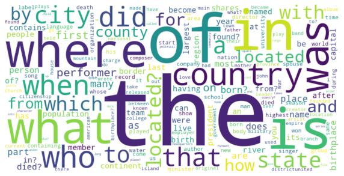
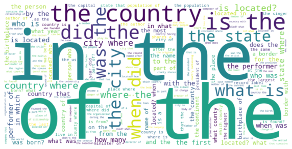
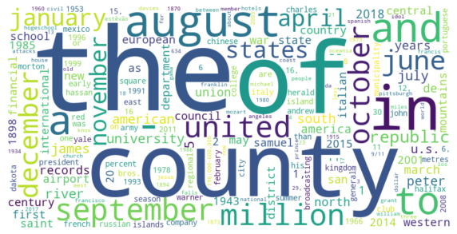

# Выводы на основании проведённого EDA

## Описательные статистики и краткое описание данных

Датасет содержит 39876 строк и 7 столбцов

### Структура датасета
1. 'id' – string, содержит id вопроса
2. 'paragraphs' – list, содержит список словарей, которые содержат id, title и содержимое блока текста, который использовался моделью для ответа на заданный вопрос
3. 'question' – string, содержит multi-hop вопрос текстом
4. 'question_decomposition', – list, содержит список словарей, которые содержат id single-hop вопроса, текст single-hop вопроса, answer на single-hop вопрос. Каждый Single-hop вопрос является составной частью multi-hop вопроса из колонки question.
5. 'answer' – object, содержит ответ на multi-hop вопрос
6. 'answer_aliases' – list, содержит альтернативные варианты ответа на multi-hop вопрос
7. 'answerable' – boolean, содержит True если модель смогла найти ответ на multi-hop вопрос, False если модель не смогла найти ответ. Актуально только для full датасетов, т к в ans датасетах answerable всегда = True.

### Пропуски и дубли
Датасет не содержит дублированных строк.

При этом, столбец "answer" содержит 7682 строки с пустым ответом – это ситуация, при которой модель не смогла ответить ни на один single-hop вопрос, заданный ей.

Также в датасете присутствует столбец "answerable" – он содержит 19938 строк с ответом "False". Судя по содержимому статьи, Answerable=False проставляется в случае, если модель не могла найти ответ на хотя бы 1 single-hop вопрос, который являлся исходным для multi-hop вопроса, а не только когда модель не могла ответить ни на один single-hop вопрос.

## расчет средней, минимальной и максимальной длины текстов

Для столбца question:
- среднее кол-во символов – 89.9
- минимальное кол-во символов – 29
- максимальное кол-во символов – 283

Для столбца answer:
- среднее кол-во символов – 14.7
- минимальное кол-во символов – 1
- максимальное кол-во символов – 100

## Частотность слов, биграмм и триграмм

До очистки наиболее часто встречаются:
Для столбца question:
- слово – the, 86398 раз
- биграмма – (of, the) 16268 раз
- триграмма - (what, is, the) 4346 раз

Для столбца answer:
- слово – the, 3232 раз
- биграмма – (of, the) 730 раз (интересно, что следующая по частотности биграмма – (United, States))
- триграмма - (halifax, regional, municipality)	110 раз

## Частотность символов и распределение по частям речи

Для столбца question:
- наиболее частотный символ – пробел, 596608 раз
- наиболее частотная часть речи - существительное, единственное число или неисчисляемое - 182013 раз

Для столбца answer:
- наиболее частотный символ – пробел, 56710 раз
- наиболее частотная часть речи - существительное, единственное число или неисчисляемое - 35605 раз

## Визуализация данных:

Распределение признака "Answerable"

Распределение признака "Длина вопроса в символах"

Распределение признака "Длина ответа в символах"

Облако слов для questions

Облако биграмм для questions

Облако слов для answers

Облако биграмм для answers

## Первичная обработка текста

С помощью библиотеки nltk и регулярных выражений очистил вопросы и ответы от стоп-слов и спецсимволов, а также проверил наличие дублей и пропусков, о чем писал в начале этого вывода.

В финальном блоке также был преобразован регистр, исключены стоп-слова, проведена токенизация и лемматизация.

